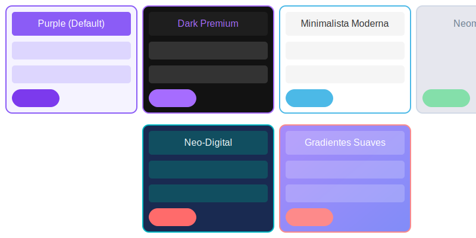

# 📊 EasyTask - Enterprise Task Management

[](https://opensource.org/licenses/MIT "MIT License")

[](https://github.com/axlwolf/task_manager)
[](https://www.typescriptlang.org/)
[](https://angular.io/)
[](https://github.com/axlwolf/task_manager#themes)
[](https://github.com/axlwolf/task_manager)


EasyTask is a modern task management application built with Angular 18, designed to help teams manage their tasks efficiently. This project demonstrates the implementation of Clean Architecture principles in an Angular application.

## Features

- **User Management**: View and select users to manage their tasks
- **Task Management**: Create, view, and complete tasks
- **Modern UI**: Clean and responsive interface built with Tailwind CSS
- **Reactive State Management**: Using Angular Signals for efficient state management
- **Theme System**: Multiple themes with CSS variables and Angular service
- **Dialog System**: Reusable dialog component with service-based API and microinteractions
- **Icon System**: Integrated icon library with microinteractions

## Architecture

This project follows Clean Architecture principles with a clear separation of concerns:

### Domain Layer

- Contains business entities and repository interfaces
- Independent of frameworks and UI

### Application Layer

- Contains use cases that orchestrate the flow of data
- Depends only on the domain layer

### Infrastructure Layer

- Contains implementations of repositories, UI components, and services
- Depends on both domain and application layers

## Project Structure

```
project-root/
├── src/
│   ├── app/
│   │   ├── features/
│   │   │   └── tasks/
│   │   │       ├── domain/
│   │   │       │   ├── models/
│   │   │       │   │   ├── task.model.ts
│   │   │       │   │   └── user.model.ts
│   │   │       │   └── repositories/
│   │   │       │       ├── task.repository.ts
│   │   │       │       └── user.repository.ts
│   │   │       ├── application/
│   │   │       │   ├── dtos/
│   │   │       │   │   └── task.dto.ts
│   │   │       │   └── usecases/
│   │   │       │       ├── create-task.usecase.ts
│   │   │       │       ├── complete-task.usecase.ts
│   │   │       │       ├── get-tasks.usecase.ts
│   │   │       │       └── get-users.usecase.ts
│   │   │       └── infra/
│   │   │           ├── components/
│   │   │           │   ├── add-task-button/
│   │   │           │   ├── button/
│   │   │           │   ├── task-card/
│   │   │           │   ├── task-form/
│   │   │           │   ├── tasks-list/
│   │   │           │   └── user-list/
│   │   │           ├── layout/
│   │   │           │   └── tasks-layout.component.ts
│   │   │           ├── pages/
│   │   │           │   └── tasks-page.component.ts
│   │   │           ├── repositories/
│   │   │           │   ├── task-impl.repository.ts
│   │   │           │   └── user-impl.repository.ts
│   │   │           ├── services/
│   │   │           │   └── tasks-store.service.ts
│   │   │           └── tasks.routes.ts
│   │   ├── shared/
│   │   │   ├── components/
│   │   │   │   ├── dialog/
│   │   │   │   │   ├── dialog.component.ts
│   │   │   │   │   ├── dialog.service.ts
│   │   │   │   │   └── dialog-ref.ts
│   │   │   │   └── icon/
│   │   │   │       └── icon.component.ts
│   │   │   ├── directives/
│   │   │   │   └── animation.directive.ts
│   │   │   ├── services/
│   │   │   │   └── animation.service.ts
│   │   │   └── pipes/
│   │   │       └── truncate.pipe.ts
│   │   └── core/
│   │       └── services/
│   │           └── theme.service.ts
│   ├── tests/
│   │   └── src/
│   │       └── app/
│   │           └── features/
│   │               └── tasks/
│   │                   └── infra/
│   │                       └── components/
│   │                           └── tasks-list/
│   │                               └── tasks-list.component.spec.ts
│   └── assets/
├── memory-bank/
│   ├── activeContext.md
│   ├── productContext.md
│   ├── progress.md
│   ├── projectbrief.md
│   ├── systemPatterns.md
│   ├── techContext.md
│   └── testingPatterns.md
├── karma.conf.js
└── test-setup.ts
```

## Documentation

- [Components Usage Documentation](src/app/documentation/components-usage.md) - Reference for shared components like IconComponent and DialogComponent
- [Directives Usage Documentation](src/app/documentation/directives-usage.md) - Reference for animation directives
- [Migration Guide](src/app/documentation/migration-guide.md) - Guide for migrating to Angular 18 standalone components
- [Code Style Guide](src/app/documentation/code-style-guide.md) - Coding standards and conventions

## Technologies Used

- **Angular 18**: Latest version of the Angular framework
- **TypeScript**: For type-safe code
- **Tailwind CSS**: For styling
- **RxJS**: For reactive programming
- **Angular Signals**: For state management
- **CSS Variables**: For theming support

## Getting Started

### Prerequisites

- Node.js (v18 or later)
- npm (v9 or later)

### Installation

1. Clone the repository
2. Install dependencies:
   ```bash
   npm install
   ```
3. Start the development server:
   ```bash
   ng serve
   ```
4. Navigate to `http://localhost:4200/`

## Themes

EasyTask comes with 6 beautiful themes that can be switched at runtime:



1. **Purple (Default)** - The classic EasyTask theme with purple accents
2. **Dark Premium** - A dark theme with purple/lila accents
   - Dark background (#121212)
   - Accent color: #A66CFF
3. **Armonía Oceánica** - A harmonious ocean-inspired theme
   - Soft blue background (#F0F9FF)
   - Accent colors: #0EA5E9 (sky blue) and #0369A1 (deep blue)
4. **Neo-Digital** - Modern tech-inspired theme
   - Dark blue background (#192A51)
   - Accent colors: #00B7C2 (turquoise) and #FF6B6B (coral)
5. **Gradientes Suaves** - Soft gradient backgrounds
   - Gradient background from purple to blue
   - Accent color: #FD8A8A (peach pink)
6. **Turquesa Fresco** - Fresh mobile app inspired theme
   - Light blue background (#F5FCFC)
   - Primary color: #2BBFB0 (turquoise)
   - Accent color: #F2994A (orange)

Themes are managed by the `ThemeService` and can be switched using the theme selector in the application header.

### Using the Theme Service

The theme system is implemented using CSS variables and an Angular service. To use it in your components:

```typescript
import { Component, inject } from "@angular/core";
import { ThemeService } from "./core/services/theme.service";

@Component({
  selector: "app-my-component",
  template: `
    <div>
      <p>Current theme: {{ themeService.currentTheme() }}</p>
      <button (click)="themeService.setTheme('theme-dark')">Switch to Dark</button>
    </div>
  `,
})
export class MyComponent {
  protected readonly themeService = inject(ThemeService);
}
```

The `ThemeService` provides:

- `currentTheme()` - A signal with the current theme name
- `setTheme(themeName)` - Method to change the current theme
- `getThemes()` - Method to get all available themes
- `loadTheme()` - Method to load the theme from localStorage

### Using the Dialog Service

The application includes a reusable dialog system built with the native HTML dialog element. The dialog system provides:

- A service-based API for opening dialogs
- Support for custom content components
- Configurable dialog size, title, and buttons
- Smooth animations and microinteractions
- Accessibility features

```typescript
import { Component, inject } from "@angular/core";
import { DialogService } from "./shared/components/dialog/dialog.service";
import { CustomFormComponent } from "./features/custom-form/custom-form.component";

@Component({
  selector: "app-my-component",
  template: ` <button (click)="openDialog()">Open Dialog</button> `,
})
export class MyComponent {
  private readonly dialogService = inject(DialogService);
  private readonly viewContainerRef = inject(ViewContainerRef);

  openDialog(): void {
    const dialogRef = this.dialogService.open(
      CustomFormComponent,
      {
        title: "Custom Form",
        size: "md",
        confirmText: "Save",
        cancelText: "Cancel",
      },
      this.viewContainerRef
    );

    dialogRef.afterClosed$.subscribe((result) => {
      if (result) {
        console.log("Dialog confirmed");
      } else {
        console.log("Dialog cancelled");
      }
    });
  }
}
```

The dialog component can be customized with various options:

- `title`: Dialog title
- `size`: Dialog size (sm, md, lg, xl, fullscreen)
- `showFooter`: Whether to show the footer with buttons
- `hideDefaultButtons`: Whether to hide the default confirm/cancel buttons
- `confirmText`: Text for the confirm button
- `cancelText`: Text for the cancel button
- `closeOnEscape`: Whether to close the dialog when the escape key is pressed
- `closeOnBackdropClick`: Whether to close the dialog when clicking outside

## Development

### Development server

Run `ng serve` for a dev server. The application will automatically reload if you change any of the source files.

### Build

Run `ng build` to build the project. The build artifacts will be stored in the `dist/` directory.

### Testing

Run `ng test` to execute the unit tests via Karma.

We follow a standardized testing approach using a setup function pattern:

#### Component Testing

```typescript
// Setup function for creating component with custom configuration
const setup = (config?: {
  /* custom config */
}) => {
  // Configure test data and dependencies
  // Setup TestBed
  // Create component
  return { fixture, component, dependencies };
};

// Example test
it("should show empty state when no data is available", () => {
  const { fixture } = setup({ tasks: [] });

  const emptyState = fixture.debugElement.query(By.css(".empty-state"));
  expect(emptyState).toBeTruthy();
});
```

#### Service Testing

```typescript
// Setup function for testing services
const setup = (args?: {
  // Custom configuration
  store?: {
    /* store config */
  };
  dialogResult?: {
    /* dialog result */
  };
}) => {
  // Configure TestBed with mocked dependencies
  // Return service and mocked dependencies
  return { service, dependencies, spies };
};

// Example test
it("should handle validation errors", async () => {
  const { service, errorHandlerSpy } = setup({
    dialogResult: { hasConfirmation: true, username: "" },
  });

  await service.execute();

  expect(errorHandlerSpy).toHaveBeenCalledTimes(1);
});
```

#### Use Case Testing

```typescript
describe("UpdateTaskUseCase", () => {
  let usecase: UpdateTaskUseCase;
  let repository: jasmine.SpyObj<TaskRepository>;
  let notifierSpy: jasmine.Spy;

  beforeEach(() => {
    TestBed.configureTestingModule({
      providers: [UpdateTaskUseCase, provideTestingServices(), { provide: TaskRepository, useValue: jasmine.createSpyObj("TaskRepository", ["updateTask"]) }],
    });

    usecase = TestBed.inject(UpdateTaskUseCase);
    repository = TestBed.inject(TaskRepository) as jasmine.SpyObj<TaskRepository>;
    const notifier = TestBed.inject(NotifierService);
    notifierSpy = spyOn(notifier, "success");
  });

  it("should update task successfully", fakeAsync(() => {
    const task = { id: "1", title: "Task 1" };
    repository.updateTask.and.returnValue(of(task));

    let result: any;
    usecase.execute(task).subscribe((res) => (result = res));

    tick();

    expect(result).toEqual(task);
    expect(repository.updateTask).toHaveBeenCalledWith(task);
    expect(notifierSpy).toHaveBeenCalled();
  }));
});
```

#### Repository Testing

```typescript
describe("TaskRepository", () => {
  let repository: TaskRepository;
  let httpController: HttpTestingController;

  beforeEach(() => {
    TestBed.configureTestingModule({
      providers: [TaskRepository, provideHttpClient(), provideHttpClientTesting()],
    });

    repository = TestBed.inject(TaskRepository);
    httpController = TestBed.inject(HttpTestingController);
  });

  afterEach(() => {
    httpController.verify(); // Verify no pending requests
  });

  it("should retrieve tasks successfully", () => {
    const userId = "123";
    const expectedTasks = [{ id: "1", title: "Task 1" }];

    repository.getTasks(userId).subscribe((tasks) => {
      expect(tasks).toEqual(expectedTasks);
    });

    const req = httpController.expectOne(`/api/users/${userId}/tasks`);
    expect(req.request.method).toBe("GET");
    req.flush(expectedTasks);
  });
});
```

This pattern provides several benefits:

- Centralized configuration for component and service tests
- Customizable test data for each test case
- Clean and focused test assertions
- Consistent mocking of dependencies
- Isolated testing of HTTP interactions
- Reusable setup across different test scenarios

See the [Testing Patterns](memory-bank/testingPatterns.md) documentation for more details.

## License

This project is licensed under the MIT License - see the LICENSE file for details.
